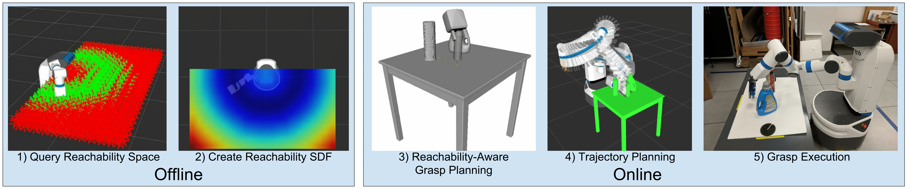
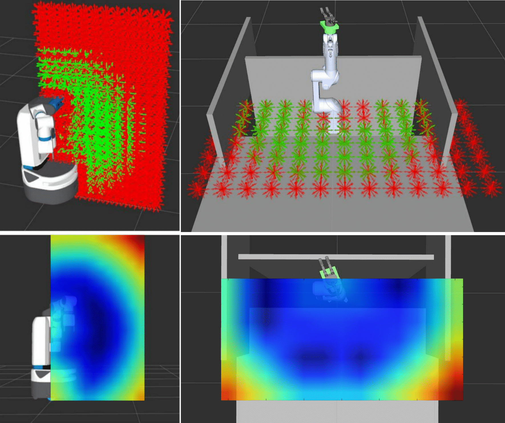

# Workspace Aware Online Grasp Planning

#### Iretiayo Akinola, Jacob Varley, Boyuan Chen  and Peter Allen

### Abstract
This work provides a framework for a workspace aware online grasp planner. This framework greatly improves the performance of standard online grasp planning algorithms by incorporating a notion of reachability into the online grasp planning process.  Offline, a database of hundreds of thousands of unique end-effector poses were queried for feasability.  At runtime, our grasp planner uses this database to bias the hand towards reachable end-effector configurations. The bias keeps the grasp planner in accessible regions of the planning scene so that the resulting grasps are tailored to the situation at hand. This results in a higher percentage of reachable grasps, a higher percentage of successful grasp executions, and a reduced planning time. We also present experimental results using simulated and real environments.

### Video

<iframe width="854" height="480" src="https://www.youtube.com/embed/smuwr-jV0wA" frameborder="0" allow="autoplay; encrypted-media" allowfullscreen></iframe>

### Links (Coming soon)

- Paper
- Bibtex
- Code for Reachability space generation
- Reachability Space Data for Fetch Robot and Staubli-Barrett Hand

